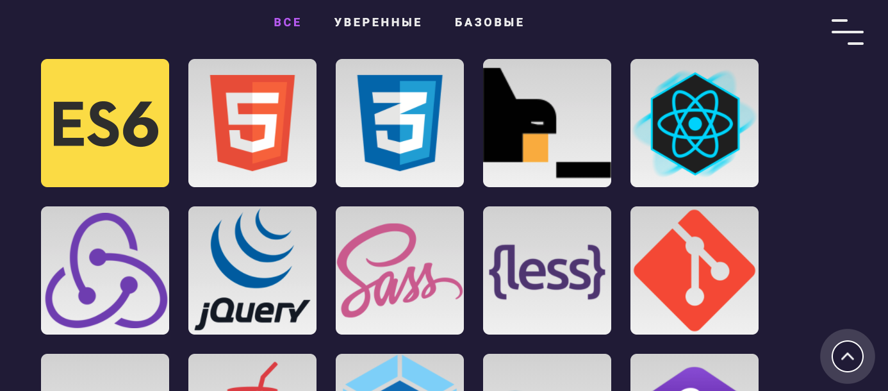

# Portfolio

## [open](https://mikhailchekov.github.io/new-portfolio/)

I learn in this project js frontend features like:
 - 'Typing text' animation
 - 'Shooth scroll' effect
 - Animate progress bar
 - Working with data attibutes

Css features: 
- Animate pseudo elements
- Some transform animations: rotate, translate
- 'Burger' menu

Technologies:
 - Js/Html/Scss(css)

